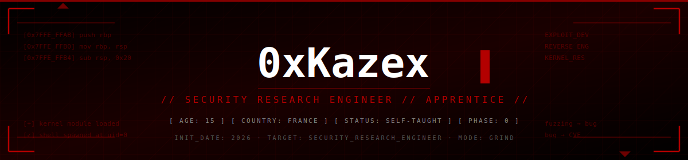
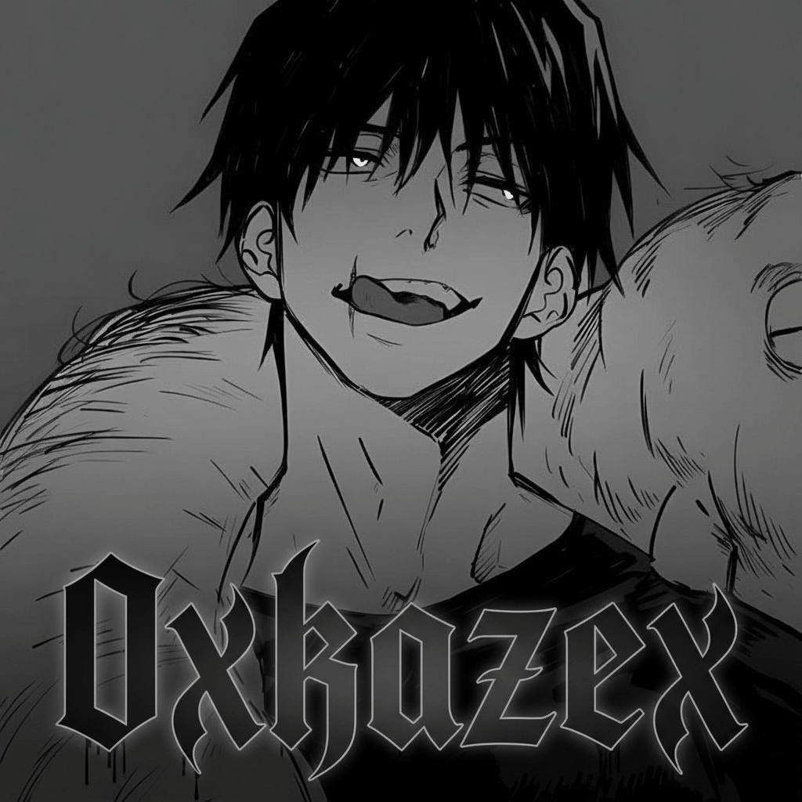
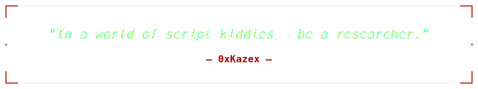
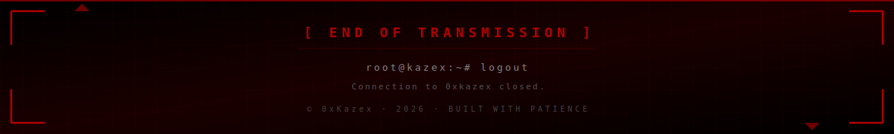

<table>
<tr>
<td width="180" align="center" valign="top">



<br/><br/>


<br/>


<br/><br/>


</td>
<td valign="top">


```yaml
operator:      0xKazex
classification: APPRENTICE
clearance:     [PHASE_0]
origin:        FR · 15 y/o
specialty:     low-level systems
                exploit development
                reverse engineering

mission:       Become a Security Research Engineer
status:        ACTIVE · 2026
philosophy:    "Consistency > Intensity"
```

<p>


</p>

</td>
</tr>
</table>


```
> Building from first principles. Line by line. Bit by bit.
> No shortcuts. No fake expertise. Just systems, math, and time.
```


<table>
<tr>
<td width="50%" valign="top">

#### 📖 NOW READING
```
[ACTIVE]  edX Dartmouth
          C Programming with Linux
          Professional Certificate
```

#### ⚙️ NOW BUILDING
```
[ACTIVE]  GitHub infrastructure
[ACTIVE]  Personal Research Lab
[QUEUED]  First C projects
```

</td>
<td width="50%" valign="top">

#### 🎯 NEXT TARGETS
```
[T-30d]   OverTheWire Bandit
[T-60d]   MIT Missing Semester
[T-90d]   Microcorruption
[T-120d]  CS:APP (CMU 15-213)
```

#### 📡 INTEL FEED
```
[FEED]    Project Zero blog
[FEED]    xairy.io
[FEED]    grsecurity.net
[FEED]    LiveOverflow
```

</td>
</tr>
</table>


<table>
<tr>
<td width="33%" valign="top">

#### `[ACTIVE]`


</td>
<td width="33%" valign="top">

#### `[LOADING]`


</td>
<td width="33%" valign="top">

#### `[QUEUED]`


</td>
</tr>
</table>


<table>
<tr>
<th align="center" width="80">PHASE</th>
<th align="left">FOCUS</th>
<th align="left" width="220">KEY RESOURCES</th>
<th align="center" width="100">STATUS</th>
</tr>
<tr>
<td align="center"><b>0</b></td>
<td><b>Foundations</b><br/><sub>C · Linux · Systems · Python · C++</sub></td>
<td><sub>edX · CS:APP · CS61C · OSTEP</sub></td>
<td align="center"></td>
</tr>
<tr>
<td align="center"><b>1</b></td>
<td><b>Exploit Dev + RE</b><br/><sub>pwn.college · Rust offensive</sub></td>
<td><sub>pwn.college · Nightmare · LiveOverflow</sub></td>
<td align="center"></td>
</tr>
<tr>
<td align="center"><b>2</b></td>
<td><b>Kernel + Advanced</b><br/><sub>eBPF · Red Team · Browser</sub></td>
<td><sub>KernelCTF · Tetragon · V8</sub></td>
<td align="center"></td>
</tr>
</table>


<table>
<tr>
<td width="40">📚</td>
<td><a href="https://github.com/0xKazex/learning-journey"><b><code>learning-journey</code></b></a></td>
<td>Roadmap · course notes · weekly logs</td>
<td align="center"></td>
</tr>
<tr>
<td>🔬</td>
<td><a href="https://github.com/0xKazex/personal-research-lab"><b><code>personal-research-lab</code></b></a></td>
<td>Paper summaries · deep dives</td>
<td align="center"></td>
</tr>
<tr>
<td>✍️</td>
<td><a href="https://github.com/0xKazex/writeups"><b><code>writeups</code></b></a></td>
<td>CTF solutions · CVE reproductions</td>
<td align="center"></td>
</tr>
</table>


<p>
<a href="mailto:0xkazex@proton.me"></a>
<a href="https://github.com/users/0xKazex/projects/1"></a>
</p>


<div align="center">



</div>


